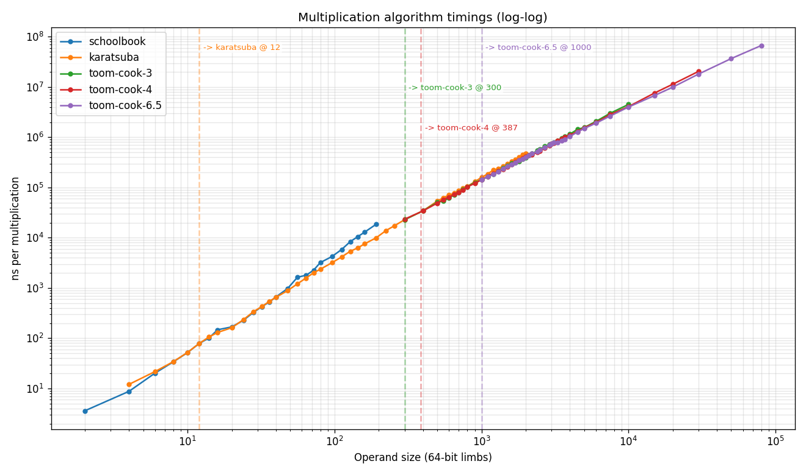

# Performance Measurements

## Simulated real-world case ECDSA sign/verify in elliptic curve space

One of our tests provides an intuitive view on elliptic-curve algebra
using big integer mathematics in the curved space. It depicts a well-known
cryptographic key-gen/sign/verify method ($256$-bit ECDSA, secp256k1).
This provides an overall performance indication using modest integer widths.
The test performs round-trip key generation, sign and verify with one
trial using random (but pre-defined) seeds, and $32$ trials using random seeds.

This is not intended to be a highly optimized ECDSA implementation, but
rather provide an overall performance indication due to the wide range of binary
and unary operations, and allocations used within it. The test is timed.
Runs with `beman.big_int`, `boost.cpp_int`, and `boost.gmp_int` are compared.
The code for this comparison can be found in [./elliptic_ecc.perf.cpp](./elliptic_ecc.perf.cpp).

| integer type     | time [s]   | relative |
|------------------|------------|----------|
| `beman.big_int`  | 2.0        | 1.3      |
| `boost.cpp_int`  | 1.7        | 1.1      |
| `boost.gmp_int`  | 1.6        | 1.0      |

## Multiplication

When measuring, localize the time of `big_int` multiplication only, running a chrono
stopwatch just before and after the multiplication operation, summing and averaging the times.

TODO: Follow the evolution of high-order multiplication and add relevant content accordingly.

Various runs use limb counts to emphasize crossover points such as the limb-cutoff
where Karatsuba --> Toom-Cook. Additional runs use higher limb counts, landing directly
in one of the ranges of testing an algoritm's complexity in as much of an isolated
way as possible. The runs involve quite high limb counts. By manipulating the constant-programmed
cutoffs, some indivicual measurements were performed to temporarily exclude certain algorithms,
then successively add, for instance, schoolbook only, then Karatsuba only and then
Karatsuba + Toom-Cook 3, and so forth.

- All the runs were numerically correct.
- We see that right around $300-400$ limbs, Toom-Cook 3 and 4 become quite beneficial.
- Higher Toom-Cook orders show similar trends. These are not explicitly tabulated, but rather summarized via their empirical timing results below.

### `beman.big_int` relative timings

| 64-bit limbs   | binary digit width   | schoolbook           |  with Karatsuba          | up to Toom-Cook 3     | up to Toom-Cook 4 | up to Toom-Cook 6.5 |
|----------------|----------------------|--------------------- |--------------------------|-----------------------|-------------------|---------------------|
| 700-1,400      | 44,800-89,600        |   1,270us per mul    |  380us    per mul        |   370us   per mul     | ---               | ---                 |
| 6,000-8,000    | 384,000-512,000      |   ---                |  8,220us  per mul        |   6,240us per mul     | ---               | ---                 |
| 10,000-12,000  | 640,000-768,000      |   ---                |  15,700us per mul        |  11,800us per mul     | ---               | ---                 |
| 21,000-23,000  | 1,344,000-1,472,000  |   ---                |  ---                     |  33,100us per mul     |  27,800us per mul | ---                 |
| 43,000-45,000  | 2,752,000-2,880,000  |   ---                |  ---                     |  ---                  |  72,300us per mul |  59,700us per mul   |

#### Toom-Cook 3 computational complexity
From the final two Toom-Cook 3 points, we seek the order of complexity, $x$

$$
2^x = \dfrac{33.1}{11.8}
$$

resulting in

$$
x{\approx}1.49
$$

The theoretical order of complexity is:

$$
\log_3(5) \approx 1.465{\text{,}}
$$

in good agreement with the measurement.

#### Toom-Cook 4 computational complexity
From the final two Toom-Cook 4 points, we seek the order of complexity, $x$

$$
2^x = \dfrac{72.3}{27.8}
$$

resulting in

$$
x{\approx}1.39
$$

The theoretical order of complexity is:

$$
\log_4(7) \approx 1.404{\text{,}}
$$

in good agreement with the measurement.

For a graphical representation of the progression of multiplication coplexity,
see also the plot below. It depicts the complexity of multiplication,
in relation to the operand limb count for many orders of increasing limb count.
Optimal cutoff points for crossing over from one multiplication scheme
to the next have been judiciously selected according to these and other related
data. This effort has been undertaken in order to optimize multiplication speed
across all orders of limb count.

### Compare multiplication timing `beman.big_int`, `boost.gmp_int`, `boost.cpp_int`

Detailed measurements (with a table) comparing the multiplication performance
of `big_int` with those of `boost.cpp_int` and GMP (wrapped by `boost.gmp_int`) are presented.
The result of multiplication adds the widths of its operands. So multiplying
two big integers produces a result having double the width of its operands.

The time and the relative time compared with the best time (see the square brackets)
are shown for each big integer type at each digit setting.

| 64-bit limbs   | bit width    | approx base-10 digits | us per mul  `big_int`  | us per mul  `cpp_int`  | us per mul  `gmp_int` |
|----------------|--------------|-----------------------|------------------------|------------------------|-----------------------|
| 128            | 8,192        | 2,500                 |   8.2   [2.0]          |   9.6   [2.3]          |   4.1   [1.0]         |
| 512            | 32,768       | 9,900                 |   74    [2.6]          |   85    [2.9]          |   29    [1.0]         |
| 1,024          | 65,536       | 20,000                |   210   [2.7]          |   250   [3.2]          |   78    [1.0]         |
| 2,048          | 131,072      | 39,000                |   590   [3.0]          |   760   [3.6]          |   200   [1.0]         |
| 8,192          | 524,288      | 160,000               |   4,100 [3.2]          |   6,800 [5.2], see (2) |   1,300 [1.0]         |
| 32,768         | 2,097,152    | 631,000               |  25,000 [4.2]          |  58,000 [9.8]          |   5,900 [1.0]         |
| 131,072        | 8,388,608    | 2,525,000             | 160,000 [5.3], see (1) | 560,000 [18]           |  30,000 [1.0]         |

GMP is written in hand-coded assembly in its hot-spots and is known as the _industry_ _standard_
of performance. The relative multiplication timing of `beman.big_int` compared with `gmp_int`
is quite respectable, considering its C++, portable design. The code used for this comparison
can be found in [mul_big_int_vs_gmp_cpp.perf.cpp](./mul_big_int_vs_gmp_cpp.perf.cpp).

(1) At the moment, `big_int` does not support FFT multiplication so `gmp_int`
really pulls ahead at very high digit counts.

(2) At the moment, `cpp_int` only reaches _as_ _high_ as Karatsuba multiplication
so both `big_int` and `gmp_int` pull ahead at medium high digit counts.

## Division

TODO: Follow the progress of sub-quadratic division.

## Base-conversion

TODO: Follow the progress of sub-quadratic base-change.
